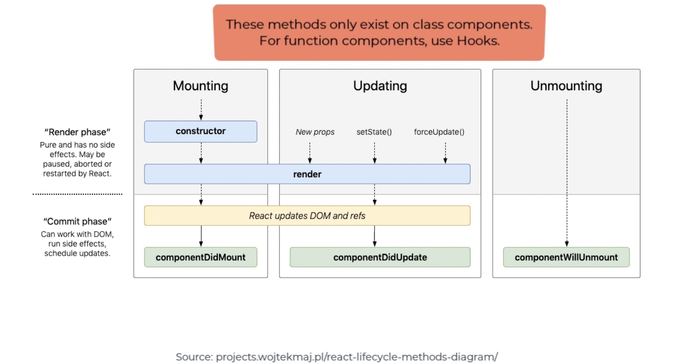

# Class Components Overview

React components start with an uppercase, and follow PascalCase nameing convention

Class based are simply Javascript classes that extend React.Component they class include:
- render(): return JSX that is what you component is going to look like
- constructor(): gets called when the component is instantiated, where you want initialize any state for your component
    - conststructor should include `super()` keyword as the first line

# Data binding

In React we can inject a variable value into a components JSX with curly braces {}, this is considered data binding

# Nested Components

React allows for components to be nested inside one another, this can create a bit of a hierarchy, or parent child relations

Parent components can share state with their child through something called props

## Props:
how we pass data from one parent component to a child component, we include the prop we want pass down in the child components tag

Props are immutable, they cannot be changed in the child class

## Destructuring:
allows you to break apart the prop being passes into the component into individual variables

`const {firstName, lastName, city} = person;`

## One-way Data flow

In React data can only Flow one way, from top down

You can only pass props from a parent to a child, not the other way around, without doing something called "Lifting State"

# State

State stores information/data about the component, it is completely encapsulated in the component.
- No outside component can access the state of another component, unless nested and passed as a prop

State is special because it is not be mutated directly, you must use the correct mutators

## Immutability

To set state in a class, you either use the constructor, or declare a field called state, then to mutate, you use the this.setState method

To set state in a function component, you use the useState hook provided by React

## Lifting State

As previously mentioned, data can only flow one way in React, and props are readonly, so we cannot change the state of a parent class from a child class

However, we can "Lift State" by passing the child component a function as a prop, that changes the state of the parents state

Lifting state is useful when a common parent/ancestor is shared by multiple other components that are sharing some common value

There are limitations when applications become too large and the entire application needs to keep track of state it becomes difficult to manage. However, we will soon learn of technology to manage these dependencies for us.

# Class Components LifeCycle: Mounting, UnMounting, Updating, Error Handling

React components have a lifecycle, and when you create a clas based component you get access to every step of this lifecycle as methods

The constructor is primarily used for initializing data in the component

componentDidMount is primarily used for grabbing/fetching data after the page loads

componentWillUnmount is primarily used for cleanup

# Functional Components

React allows you to create components based off of functions
- These are simplier, and more straight forward to write
- With the inclusion of Hooks, functional components are now (almost) powerful as the more bulky class based components
- As long as the function returns JSX or TSX it will be valid react component

# Hooks:
functions that allow you to "hook" into React state and lifecycle methods from function compontents

## Basic Hooks: useState, useEffect, useContext

useState:
- allows you to store and mutate state inside of a function component
- declare a state variable and a mutator inside of square brackets, then useState(defaultVal) to set the state
- use the declared mutator to change and update the state
- with useState, the state does not have to be an object like in classes

useEffect:
- allows you to perform some logic at specific points in the application life
- its takes in a callback function that performs some logic
- it can be used to watch for specific events/changes in state to perform some logic

useContext:
- used to access values being used with the ContextAPI
- Context is a way to store application state

# React Hands On: With any type of component and CSS, create a user profile page