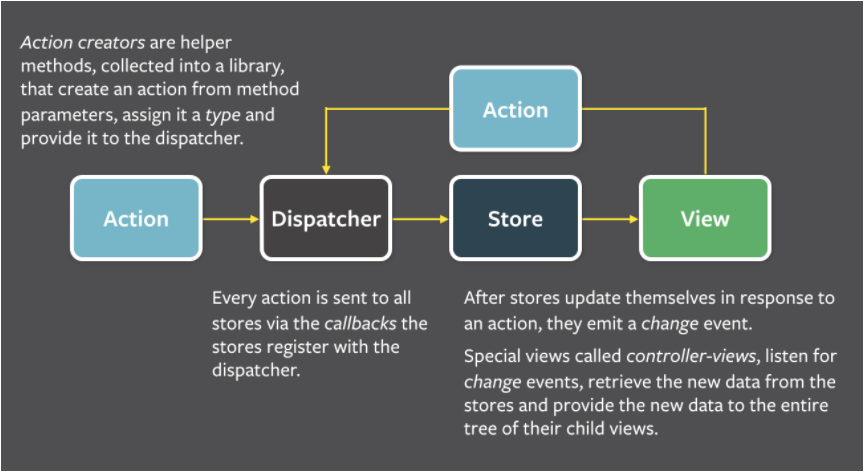

# Event Handling

Event handling in React is similar to HTML, however with JSX you must use camelCase for the event name, and pass tghe event handler as a JS reference rather than a string

## Synthetic Events:
cross browser wrapper around the browsers native event, this is used when an event occurs in React

Used because it is capable of pooling, which means the SyntheticEvent objects are reused to improve performance, however, issues can arise because after the callback is called the properties are nullified

# List and Keys

If you want to render a list of elements in React, it is typically done with the `.map()` function

However, React expects you to provide a unique key for each element that you are mapping through.
- This helps React indentify which items have been changed, added, or removed

The only time you should use an index as a key is when you have no other options

# Hands on Number 1, create a stop watch using event handlers and the setInterval function from javascript

# More Advanced Component Techniques

## Higher Order Components:
functions that take a component and return a new component with added functionality

These can be used to handle cross cutting concerns and allow for more reusablity

You can either create your own higher order components, or there built in ones, like React Router withRouter is a high order function that provides more routing functionality

## Containment:
used when a component doesn't know its children ahead of time, common for use with components that represent generic boxes

You would pass the components through props to the containing component, then you can pass whatever child components to the parent component through said prop

## Specialization
used when a component is a special case of another component

Again you would pass the different components as props, this time they should be separate props unlike above

Then the parent component would choose whether to render the "generic" or "specific/special" child component based off of some logic

# Routing
allows users to have the experience of navigating through different pages while actually staying on the same SPA page

React can swap out views with different URL paths
- React is not actually SPA by default, however, using React Router is the most popular way to make it a SPA with routing

# React Router and React Router DOM

React Router is a declaritive model for navigational components within your application

React Router DOM provides several solutions for creating a router in your application depending on the relationship you want your UO to have with your URL

## BrowserRouter:
uses HTML history API to keep the UI in sync with the URL
- Wrap the BrowserRouter tag around `Route` tags, where each Route represents a renderable component
- The component to be rendered is nested inside of the Route tag
- The `Switch` tag is used to ensure that each component is rendered exclusively per route

# React Application State Management:

React has an Application State Management problem, all data can only flow one way, so sharing state between multiple components can become tricky

There are three possible solutions for this probelem:

1. Lifting State: we have already seen this is usable, however it becomes too complicated quickly

2. React Context API: a built in centralized data store that comes with React

3. Use the Flux Design pattern through React Redux

The advantages of using Flux design pattern:
- manage state through one centralized place
- allows you to more easily handle complex data flows
- conductive to inter component communication and no hierarchical data
- leverages unidirectional data flow

# Flux Design Pattern:
an application architecture design by Facebook to combat/work better with Reacts unidirectional data flow
- It is more of a pattern than a framework
- It is way of passing information through an application

Flux uses a central "Store" to store the shared application state, dispatcher to dispatch actions that change the state of the store, and views which display the data held in the store

## Basic Flux Flow

# Store:
manages a collection of objecst that representthe application state for particular domain within the application

An application can have multiple store, each with its own responisbility
- They are thought of has somewhat similar as models in the MVC architecture
- When a store is updated it can alert components anywhere in the application that are relying on the data to update

# Dispatcher:
the dispatcher is the central hub that manages the flow in a flux application
- it is a function that is called to update information from action compared to the old information in the store
- it gives the store a new representation of the data to hold

The central Dispatcher can route different actions to the stores across the application
- each store registers itself with the central dispatcher

# Actions:
simple JS objectsthat contain some payload of data, these are sent to the dispatcher, and handled in the correct reducers

# Reducers:
functions that calculate the new state of the store based on the previous state and the action provided
- The reducer should not mutate the state of the store directly, rather just return the new state

# View:
what end users will see

# More Benefits of Flux:

Information is held globally:
- No more lifting state
- Particular data can be subscribed to by components so they are informed when the data is updated
- Avoid prop drilling

Single Source of truth
- Information is held in a store, and not duplicated across mulitple components

Data in the store is immutable
- This makes it easy to compare across updates and test

# Drawbacks of Flux

Can be complicated to implement with multiple levels that need information

Does not work with async logic flows
- To make async calls the pattern has to expanded

# Redux 
redux is an implementation of the Flux design pattern for Javascript applications
- it is not build only for React, however, there is a library for react

# Redux Libraries and Tools

## React-Redux

The official library for using Redux with React, install it with npm

## React Toolkit (Optional):
A library of additional support functions that can make using redux easier and conform more to best practices

## Redux DevTools (Optional):
A browser extension that lets you see changes made to the store over time in the browser

# Redux Application Flow:

1. Create a base store when the application begins. The store will have its state which is the current values of all data being stored

2. Actions, these are TS objects that have a "Type" field defining the action being taken. If the action has data that needs to be transported to the store that data is put in the "payload" field

3. The action is dispatched to the store and particularly to the reduer that will handle the action type

4. Reducer determines how to handle the action based on type. Reducers are generally switch statemtents that switch on the action type
    - Reducers should be pure functions, taking in data and returning the state without any side effects. This means that they can't make HTTP calls, or do async logic. This is done so that the code is predictible. Testing libraries, Redux Webtools, and other rely on this to enser that they function properly

5. The reducer returns the new state, then the state of the store is updated, the subscribers to the store are notified and the information on the view is updated

# Thunks:
functions that can used instead of objects to promise that an object will be given at a later time
- allows us to delay the synchronous nature of the flux design pattern while we retrieve async data

Thunks are not implemented by default in base redux and have to be included if you are going to use them.

Redux toolkil does include them by default

Promises are built using Thunks under the hood along with additional functionality. The additional functionality causes side effect making promises not applicable for Redux

# React-AJAX

To create AJAX requests in React we can either use fetch or Axios

# Axios
a promise based HTTP client for the browser and NodeJS

It is supported by most modern browsers, and comes with the following features:
- Intercepting and transforming requests and response data
- Automatically parses JSON response data
- Canceling of requests
- Better error handling
- Built in protection vs cross site request forgery

# Axios vs Fetch

Fetch is tied to the window object, which doesn't make snese in a server environment like NodeJS, Axios works more cleanly on the server side

Axios automatically stringifies and parses resquest/response bodies to and from JSON

Axios can cancel, timeout, and interupt HTTP requests, fetch cannot

Ultimately its up you which you use with React, because they still quite similar