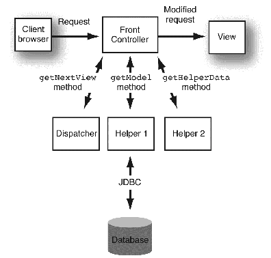

# Jackson Library

The Jackson API is used to convert Java Object into JSON format to send in an HTTP response, and to convert http request bodies to Java objects

Use the ObjectMapper.writeValue() method to convert a Java Object to JSON

Use ObjectMapper.readValue() methos to convert JSON objects to Java objects

# Request Dispatcher

The request dispatcher interface defines an object that passes along the clients request to other resources on the server

There are two possibilites with the Request Dispatcher

- forward(req, res): passes a request from one servlet to another resource on the server. The contents of the request and response are preserved and forwarded to the next resource which will process the data, and return it to the client
    - The client will not know it was forwarded because the url does not change

- include(req, res): does not entirely transfer control over the request and response object to the next resource. Instead this method includes the content of the orginal resource in the response returned to the client

# Redirecting with the Response Object

The .sendRedirect(url) method on the HttpServletResponse object, allows you to redirect the client to a resource outside of the server

Opposed to the forward method on the Request Dispatcher which directs the client to a different resource inside of the server

# Hands With Servlets
1. Create a Register Servlet
    - The app should display the Register page when a get request to /register
2. Create a Register html page with a form to register a user with the user model
3. After creating a user, you should be redirected to the login page

# Servlet Config and Servlet Context

Serlvet Config is an object created by the Servlet Container, used to pass initial parameters or configuration information to a particular servlet

- Setup inside of the `<servlet>` tags in the web.xml
- User the `<init-param>` and nest `<param-name>` and `<param-value>` inside of it
- You can programatically get these properties with .getServletConfig() method of the HttpServlet class

ServletContext is the object created by the Servlet Container to share inital parameters or configuration will all servlets and other components

- Use the `<context-param>` tag outside of the `<servlets>` tag
- Inside of the context param tag you use `<param-name>` and `<param-value>`
- You can programatically get these properties with the .getServletContext() method of the HttpServlet class

# Eager Loading and Lazy Loading Servlets

Eager Loading the servlet container loads and initializes the servlets when the server starts running

Lazy loading the servlet container loads and initilizes the servlets when the first request arrives

To enable Eager loading include the `<load-on-startup>` tag in the servlet mapping 

The number inside of the load on startup tells the servlet container what sequence the servlets should be loaded

# Filters:
are used to intercept a request and conduct pre or post processing on the request

Configure them in the deployment descriptor, and use the FilterAPI found in javax.servlet package to define what the filter does

## Filter API

Has three interfaces:
1. Filter: creates a filter by implementing the interface, it provides the life cycles methods for a filter
2. FilterConfig: an object that contains the filters initilization parameters
3. FilterChain: an object used to call the next filter in the resource chain

## Filter Life Cycle Methods:

init(FilterConfig config): called once and used to initialize the filter

doFilter(HttpServletRequest req, HttpServletResponse res, FilterChain chain): this method does the filter logic, filterchain allows you to move onto the next filter

destroy(): called once when the filter is taken out of service

In the Java Servlet API 4.0 we only need to override the doFilter() because init() and desrtoy() are implemented as default methods

# Exceptions and Error Handling

The servlet API allows us to handle exceptions and erros caused during execution of a servlet, and still send a useful response to the user

You just need to include the `<error-page>` element in your web.xml, this is used to specify the invocation of servlets in response to certain exceptions or http status codes. You can use the following inside of `<error-page>`
- `<error-code>`: used to specify the status code
- `<exception-type>`: used to specify an exception
- `<location>`: used to specify the location to a resource which is displayed upon an error

Before the servlet container invokes the servlet to handle the exception, it sets some attributes in the request to get useful information about the exception:
- javax.servlet.error.status_code
- javax.servlet.error.servlet_name
- javax.servlet.error.exception
- javax.servlet.error.request_uri
- javax.servlet.error.exception_type
- javax.servlet.error.message

# Introduction to REST

## REST: Representational State Transfer

It was originally designed by Roy Fielding in 2000 in his dissertion stating:

- Rest is an architectural style that outline communication between a client and a server over the web

To be RESTful you must adhere to these six constraints

1. Uniform interface: your URL's to resources should be uniform and self descriptive
2. Client-Server architecture
3. Stateless: the server should hold no information about the state of the session
4. Cacheable
5. Layered System
6. Code on Demand (optional)

# Session Management in Servlets

The HTTP protocol is stateless, meaning that it does not store any client information on the server

We can create what we call sessions, and send the session information in every request the client makes

Session tracking is a mechanism a servlet can use to maintain state about a series of requests, there are several ways to create a session:

- HttpSession API
- URL Rewriting
- Hidden Form Fields
- Cookies

## HttpSession API

The servlet API provides HTTPSession interface which provides a way to identify a user and to store information about that user

The servlet can generate a unique session ID and give it back to the client, who will send that ID with each request going forward

To create session, you simply use the HttpServletReqest objects .getSession() method, and if one does not exist it will create one

Other important methods to know include:

-   **setAttribute(key,object)** - used to bind an object to the session, using the key specified.
-   **getAttribute(String)** - used to retrieve a specific saved object from the session object, using its key.
-   **removeAttribute(key)** - used to remove the object bound with the specified key from the session.
-   **invalidate()** - destroys the session.
-   **getId()** - returns the unique ID assigned to the session.
-   **getCreationTime()**- returns the time when the session was created
-   **getLastAccessedTime()** - returns the last time the client sent a request associated with the session
-   **getMaxInactiveInterval()** - returns the maximum time interval, in seconds.
-   **setMaxInactiveInterval(int interval)** - Specifies the time, in seconds,after servlet container will invalidate the session.

## URL Rewriting

URL rewriting is a process by which a unique ID gets appended to each request URL, so the server can identify the user session

URL rewriting maintains the session and works even when the users browser does not support cookies

## Hidden Form Fields

Hidden fields can be inserted into webpages by servlet for session tracking

The fields are not visible directly, but can still be seen in the inspect window, so they should not be used for security

You can use these to send session data through form data, and the user will never see it

## Cookies

Cookies are key-value pairs of information sent by the server to the client, which the client stores

- then you send the cookie in the HTTP request header

The servlet can the check for the presence of the cookie, most likely to get session information

There are two types of cookies:
- Non-persistent: a cookie that expires when the user closes the browser
- Persistent: a cookie that only expires if the user logs out of the website, it is stored even after the browser is closed

# MVC Design Pattern
Model View Controller Design Pattern, it is a pattern that is used to design user interfaces and structure applications

Model: used to represent the business later of the application, aka the data layer which defines the business logic of the system, and represents the state of the application

View: the presentation layer/ui of the application. It displays data that is fetched from the model layer by the controller

Controller: the link between the view and the model, it receives user requests from the view, talks to the model layer, and returns data to display on the view.

The advantage of breaking up our application like this, is that multiple developers can be working on each independently of each other

It also enables logical grouping of related actions on a controller together

# Front Controller Design Pattern

a design pattern that provides a single handler for all incoming requests for a resource in an application, then dispatches the requests to the appropriate secondary handler for that type of request

It uses a helper API to achieve the dispatching mechanism, it is broken up into four components:

Front Controller: is the single point of entry for the requests, it directs requests to the dispatcher

Dispatcher: reponsible for managing the actions and the views, including locating and routing to specific actions that will service a request, and finding the correct view

Helper Classes: are used to break up the logic of specific features, and makes the program easier to build and maintane

Views: represent and display information that we want to display to the client

