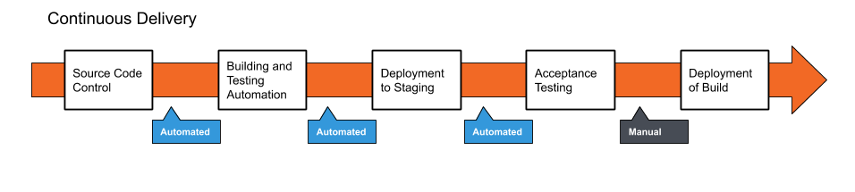

# DevOps Overview

DevOps is the combination of Development and Operations

And is a set of practices and methodologies designed to combine the production/writing of code and deployment/maintenance of code into one stream lined process

The primary goal of DevOps is to expedite the lifecycle of application development, particulary through the automation of tasks

This can help save money, and decrease time between releases

There is generally fives or phases to DevOps:

1. Source Code Control: Producing (writing) code and pushing to a repository
2. Building and testing automation: Test basic functionality of code, generally writing unit tests, and create a new working build
3. Deploying to staging: Deployment of working builds to a temporary environment
4. Acceptance Testing: Undergo more complex tests, (systems, integration) within the temporary environment
5. Deployment of Build: Migrate working build to the production environment access by end users

# DevOps and Agile

Adoption of the Agile process can provide a stepping stone for the establishment of a working DevOps pipeline

The processes of Continuous Integration, Continuous Delivery, and Continuous Deployment are used with agile to automate the phases of DevOps as much as possible

# Continuous Integration (CI):

CI is the process of regularly and consistently merging code into a central repository and reviewing new code to ensure that it integrates well within the previously established code base

It is the first and most fundamental step in creating an autonomous development pipeline

It is a development team mentality, and it is achieveed when all members of the development team practice consistent merging of code into a central repository, these whould be in form of version control software

Continous Integration provides the following benefits:
- Ensures the entire team works on the most up to date code
- Detect broken builds quickly
- Code can be tested easily by creating separate test or development branches
- Reduces the risk in development when a large code base had already been established
- Reduces the overall amount of bugs in the project

# Continuous Delivery (CD):

CD allows for the building, management, and testing of produced software to be automated such that deployments can be performed at the push of a button

It is dependent upon the implementation of Continuous Integration, it can take code that is being pushed regularly, and build, test, and deploy it to a production like enviornment for final testing

The application is automatically ready for release, and can be released with the push of a button

Benefits of Continuous Delivery:
- Reduced risk in deployment
- Predictible progress
- Frequent feedback

# Continuous Deployment (CD):

This is the final step in completely automating your software production

It will automatically build, test, and deploy your software to the production environment, anything code is pushed to main branch

It is essentially the final addition to Continuous Delivery, it is the fully automated pipeline

Benefits of Continous Deployment:
- Even faster development process, without the need to pause for deployment
- New releases are less risky, as small changes can be can be easily recognized and fixed, allowing for better and quicker feedback
- Increased communication and regular streams of improvements are generally seen as a good thing from customers

Cost/Risks of Continuous Deployment:
- Establishing a Continous Deployment pipeline requires more substantial investment in engineering and testing culture
- Documentation of processes is required to communicate to development, production, and testing team
- Ongoing maintenance of deployment pipleine is required to ensure work continues running smoothly, increasing production costs
- Feature flags are required for coordination between departments

# Maven Review

When Maven builds a project, it must search for any dependencies declared in the pom.xml

These dependencies are stored both locally and in a central repository
- Locally Maven stores these at $HOME/.m2/repository by default
- The central repository is accessible at https://mvnrepository.com

If Maven cannot find a dependency locally, it will go to the central repository and download it

## Maven Lifecycle

When Maven builds a project, it taks all the source code, dependencies, and compiles and bundles it into an artifact, this can be .war, .jar, or a .ear
- You can either run these directly, or deploy it on a web container

There are three built in life cycles for Maven:

- Default handles project deployment
- Clean handles project cleaning
- Site handles the creation of our project sites documentation

When Maven builds your project, it goes through several steps called phases. The default Maven Build lifecycle goes through the following:

1. Validate => project is correct and all necessary information is available
2. Compile => compiles project source code
3. Test => tests all compiled code
4. Package => package all compiled code to WAR/JAR file
5. Integration => performs all integration tests on WAR/JAR file
6. Verify => runs checks on the results of the intregaration tests
7. Install => installs WAR/JAR to local repository
8. Deploy => copies final WAR/JAR to the remote repository

# EC2 Autoscaling

Allows you to scale up or down the resources for your application automatically to maintain availability of your application

- It automatically adds or removes EC2 instances for you

## Horizontal and Vertical Scaling

Two types of scaling:
- Vertical: increases the size of individual resources
- Horizontal: add additional resources

AWS provides horizontal scaling

Benefits of Autoscaling:

- Improved fault tolerance, detect a faulty instance and replace it with a new one
- Increased application availablity, insure your application has the right amount of computer power at any given time
- Lower costs, only increase the number of instances when needed, instead of paying the increased amount the entire time

Autoscaling groups are collections of EC2 instances with similar characterists
- You can use these to increase the number of instances to improve performance
- You can use these to decrease the number of instances to reduce cost
- You can use these as a fixed amount of instances

Launch Configurations allow you to set certain parameters for autoscaling

Scaling Plans tell how and when to scale, there are three plans:
- Scheduled Scaling
- Dynamic Scaling
- Predictive Scaling

More information, and how to set it up can be found here:

https://docs.aws.amazon.com/autoscaling/ec2/userguide/GettingStartedTutorial.html#gs-tutorial-next-steps

# Cloud Watch Logging
an AWS service that allows you to:
- Query you log data from other AWS services
- Monitor logs from EC2 instances
- Monitor AWS Cloudtrain logged events
- Log retention
- Archive log data
- Log Route 53 DNS Queries

# Jenkins

Jenkins is a self-contained, open source automation server, which can be used to automate the building, testing, and deployment of software.

It can installed standalone on a system, or work with tools like Docker

# Jenkins Projects, Jobs, and Builds

In Jenkins you work with Projects/Jobs:
- Each job is a repeatable set of steps that automate a task
- You can trigger your jobs manually, externally, or by other jobs
- When a job is triggered, it create a build

Jobs have status called Health. The health is represented by a weather condition
- Sunny: 81% or more build passed
- Partially Sunny: 61 - 80% passed
- Cloudy: 41 - 60% passed
- Raining: 21 - 40% passed
- Stormy: 20% or less passed

Builds have a more traditional status, each one gets a colored circle representing success or failure
- Blue: success
- Yellow: unstable
- Red: Failure
- Gray: No builds/aborted build

# SonarCloud/SonarLint

SonarCloud and SonarLint are code quality analysis tools which increase the readablity, security, and maintainability of code

These tools can help produce higher quality code, and provide standardization between developers

Code Quality Analysis tools are programs specifically designed to expose errors as well as code smells

- Code Smells: Charachteristics of the code that while not actually preventing proper functionality, they may enventaully prevent the maintainablity of you code
- Vulnerabilities: data security issues
- Bugs: issues with the actual code functionality
- Maintainability Issues:
    - Confusing or hard to maintain code
    - Repeated Instances of code
    - Unused imports
    - Empty code blocks
    - Unaddressed automated code comments

SonarClous is a cloud based review solution which can be configured to review code witin a cloud repositotr, such as Github

How to setup Sonar Cloud: https://sonarcloud.io/documentation/getting-started/github/

Sonar Lint is a free, opensoure linting tool which you can install directly into your IDE

Traditional IDE's use some sort of linter, but Sonar Lint provides further linting as listed above

To install on Eclipse/STS, you can simply go to the market place and search for Sonar Lint and install