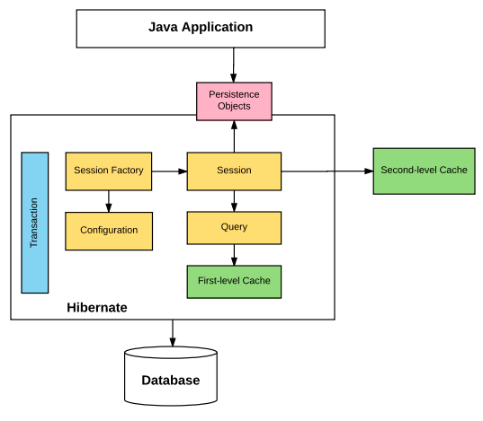

# Object Relational Mapping (ORM's)

ORM's convert the data between relational databases and object oriented programming langauages
- Essentially turn Java objects, into an entry in a database table for us

Most object-oriented application store data in relational databaes which use tables, while the application classes create objects, in order to get data from one to another we must do some conversion

This conversion makes it impossible to directly store objects into realational databases, this difference is called impedance mismatch

Impedance mismatch can exist at the following points:
- Granularity: refer to the mismatch in the number of classes that are mapped with a certain number of tables in a database
- Interitance: tables within the database cannot be representented through an inheritance hierarchy\
- Identity: The relational database distinguishes an object instance on the basis of their primary key, however an object model distinguishes the basis on object indentity and object equality
- Association: In the object model, two classes are linked by associatation, however in relational databases, the linking of tables is achieved by foreign keys
- Navigation: the ways of accessing objects in Java and in RDBMS are fundementally different

Benefits of ORM's:
- ORM's map an object to the table for you
- we can hide the details of SQL queries from OO logic, this propagates the idea of data abstraction
- it provides methods for automatic versioning and time stamping
- it provides caching for better performance
- best suited for large projects
- injected transaction management
- configurable logging
- faster development of applications

There are lots of ORM's available, including Hibernate, JPA, Active JOA, iBATIS, IBM Pure Query and more

# Hibernate and JPA

## JPA

JPA is the Java Persistence API, and its the standard API for accessing, persisting, and managing data between Java objects/classes and relational databases

You can find it in the javax.persistence package
- It uses the Java Persistence Query Lanaguage which is an object oriented query language
- It uses EntityManager: an interface to create, read, update, delete operations for instances of mapped entity classes

## Hibernate

Hibernate is an ORM tool for Java programming
- It is flexible and powerful ORM solution to map Java classes to database tables
- It is an implementation or JPA, so it follows the standards provided by JPA
- It is defined under the org.hibernate
- It uses the Hibernate Query Language which is similar to JPQL
- Hibernate session interface is an extension to JPA's EntityManager

Why we shouldn't use JDBC anymore:
- Large applications result in significant complexity
- Changing our database reults in significant refactoring
- Must convert our database ResultSet to Java objects, and vise versa
- The developer requires database specific knowelege
- The state of Java Objects are fetched and managed by developers

The benefits of Hibernate:
- Transparent persistence ensures the automatic connection between the applications objects with the database tables
- Hibernate is database independent
- Hibernate framework provides abstraction, including establishing connections, writing queries to perform CRUD, and more
- Hibernate supports dual-level caching, making hibernate highly scalable

# Hibernate Architecture

Hibernate is broken up into several key interfaces, which make up what we call the Hibernate Architecture

Persistent Objects are instances of POJO classes, that each represent a row in a table in the database

## Interfaces of Hibernate

Configurable (Class): represents a configuration or properties file for hibernate. Created once during application initialization.
- It is used to create the SessionFactory
- The configure() method load mapping and properties from the hibernate.cfg.xml
- addAnnotatedClass() method is used to specify an entity class
- setProperty() method is used to add properties like hibernate.connection.url
- An expection will be thrown if the config file is not valid

SessionFactory (interface): is used to create a session. It is a thread-safe and immutable object mapped to a single database. It also holds the second level cache

Session (interface): is create by the SessionFactory, and is used to perform CRUD operations on the DB
- Session Objects wrap the JDBC connection and serve as a factory for Transaction, Query, and Criteria objects
- Session Objects are not thread safe
- Lightweight and hold the mandatory first-level cache
- Perform CRUD operations with:
    - Create: .save(), .persist(), .saveOrUpdate()
    - Read: .get(), .load()
    - Update: .update(), .merge()
    - Delete: .delete()

Transaction (interface): a transaction is associated with a Session, and typically instantiated by a call to Session.beginTransaction()
- Transaction object is used whenever we perform any operation and based apon that opertation there is some change to the database
- You can do several operations and then commit the transaction
- We can rollback all previous uncommitted operations, transactions are not automatically committed
- Transactions are handled by the underlying transaction manager and JDBC transaction or JPA transaction

Query (interface): an instance is obtained by calling Session.createQuery()
- Can be used to expose extra functionality beyond what is provided by the Session
- You may select a page of a result set by calling setMaxResults() or setFirstResult()
- Can write queries in Native SQL, or HQL

Criteria (interface): is a simplified API for retreiving entities by composing Criterion objects
- You can create a Criteria object with Session.createCriteria()

# XML Overview

XML Stands for extensible markup language

It was designed to transport and store data in a way that is both machine and human readible

You can parse XML with Java using JAXP

You can bind XML in Java using JAXB
- Binding is converting XML to Java Objects or vise versa

# Hibernate Configuration

The hibernate configuration file is the hibernate.cfg.xml file, and it store database mapping information that tells hibernate how it should communicate with the database, and where the mapping for individual classes/tables can be found

- Data stored includes JDBC Connection URL, database user credentials, driver class, and hibernate dialect

This file gets loaded through the Configuration Class and creates a SessionFactory

The root tag of the hibernate.cfg.xml is the `<hibernate-configuration>`, inside of this is the `<session-factory>` tag which will store all the database information

`<mapping>` element tales a single java class that is mapped to a table

- If you are using annotations you should use the attribute class
- If you are using an xml file you should use the attribute resource

Other important hibernate.cfg.xml properties include:

-   **hibernate.dialect** - specifies the type of database used in hibernate so that hibernate generates the appropriate type of SQL statements. The [org.hibernate.dialect](https://docs.jboss.org/hibernate/orm/5.4/javadocs/org/hibernate/dialect/package-summary.html) package contains the SQL dialect for the databases.
-   **hibernate.connection.driver_class** - used to register or load the JDBC driver class. The name should be fully qualified class name like `oracle.jdbc.driver.OracleDriver` for oracle , `com.mysql.jdbc.Driver` for MySQL, etc.
-   **hibernate.connection.url** - used to mention the JDBC URL to the database instance.
-   **hibernate.connection.username** - username used to connect to the database.
-   **hibernate.connection.password** - password for the username being used to connect to the database.
-   **hibernate.connection.pool.size** - used to limit the number of connections waiting in the Hibernate database connection pool.
-   **show_sql** - If this property value is _true_ then it enables the logging of all hibernate-generated SQL statements to the console.
-   **format_sql** - If this property value is _true_ then it formats the generated SQL statement to make it more readable.
-   **use_sql_comments** - If this property value is _true_ then it insert comments inside all generated SQL statements.
-   **hibernate.hbm2ddl.auto** - used to create, update or validate the database schema DDL when the SessionFactory Object created. The four possible values for this property are,
    -   **create** - creates new database tables based on your class mappings. If a table already exists, then it will drop the existing table and create a new table.
    -   **update** – Updates the existing database tables to match the class mappings. If a table doesn't exist, then it creates a new table.
    -   **validate** - validates the existing tables against the provided mappings, and doesn't make any changes to the database. If the validation fails, the application will not work properly.
    -   **create-drop** - as create, but explicitly drops all existing tables when the SessionFactory is closed (which of course loses all the data in those tables).

You can also use hibernate.properties file, however, you cannot mapp classes with this file, so you would have to manually use the Configuration class to map your classes