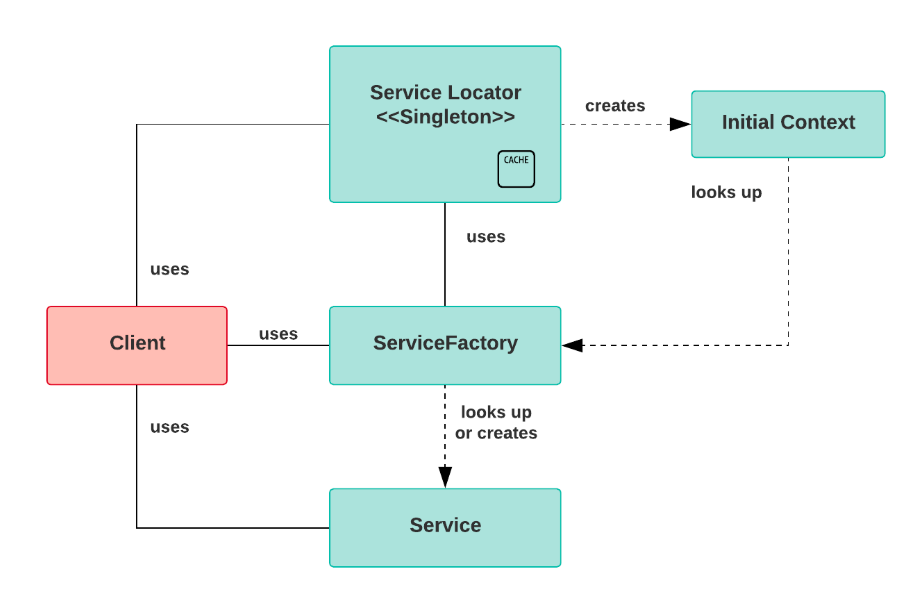

# Annotations for Model Classes

There are two ways to map a class to a database table in hibernate
- Using annotations
- Using an XML mapping file

It is a more modern approach to use Class annotations, because you have less xml files in your project, and it makes your project easier to follow

Hibernate annotations provice a nice easy way to define mappings directly in your POJO classes without the use of XML files

Hibernate annotations are based on JPA 2 specifications, so you should be using the annotations that are defined in the javax.persistance package

A list of common annotations:

- `@Entity` : used to mark a class as a Mapped class/ Persistence class. This class must have a no-arg constructor with package visibility so that hibernate can create an instance of the persistence class by the `newInstance()` method

- `@Table` : Used to specify the table details that are used to persist the entity in the database. If the name of the database table differs from the name of the class, the name attribute should be used.

- `@Id` : Used to mark the field as a primary key column. Annotating multiple fields with @ID will make them composite keys

- `@GeneratedValue` : Used to instruct the database to generate a value for the field automatically, and to provide a strategy for doing so

- `@Column` : Maps the field to the table column. @Colum annotation has attributed that are listed below:
    - `name` : used to specify the name of the column, by default its assumed the column name and variable name match. This attribute is required only if that is not the case
    - `length` : used to specify the size of the string value
    - `nullable` : used to mark the column as either nullable or not nullable
    - `unqiue` : used to mark the column as unique

# Object States

In hibernate, an object of a persistence class can be in one of three states. These state are defined in relation to a persistence context (Session object)

1. Transient
- When an object is created with the new keyword but not yet associated with a hibernate session
- It doesn't represent a row in the database
- Transient instances are garbage collection if the application does not hold a reference anymore

2. Persistent
- The object state is persisten when it is associated with a hibernate session
- The persisten object represents a row in the database and has an indentifier value
- Transient instances can be made persistent by associating them with a session
- The .save(), .persist(), and .saveOrUpdate() methods try to associate a transient object with a session and make them persist
- Hibernate detects changes make to persistent objects and synchronizes the state with the database
- Whenever we get data from the database using .get() or .load(), the data will be in the persistent state

3. Detatched
- When a persistent object has its sessions closed it becomes detached
- Any changes made to detached objects will not save automatically to the database
- When a detached instance is reattached with a new session at a later time, it makes the object persistent again
- The sessions class' .close(), .evict(), and .clear() methods are used to move a persistent object to the detached
- The session class` .update(), and .merge() methods can reattach objects to a session

# Native SQL

Native SQL allows you to write regular database specific queries

It is not recommended to use Native SQL becauyse it tightly couples your program to your database

To create a Native query you would use Session.createNativeQuery()

Native queries return a list of objects arrays which we need to explictly cast to the correct datatype to avoid this you can use .addScalar()

The .addEntity() method is used to get entity objects from Native SQL queries

The .addJoin() method is used to fetch data from an associated table using a join

# HQL (Hibernate Query Language)

is a object oriented query language, it allows you to query agains persistent objects insteads of tables and columns

Hibernate automatically translates the HQL queries into native sql using the dialect you have chosen

- This helps decouple our code from the database, becuase you can simply change the dialect at anytime

HQL is case sensitive for properties like tables and column names, but not for keywords like Select from, and so on

Advantages of HQL:
- Support of OOP concepts like Polymorphism, Inheritance, and abstraction
- Database independent and easy to learn

# Criteria API

The Criteria API is a programatic and typesafe way to fetch data from a relational database

Instead of writing query strings, you use methods on the Criteria object to fetch data

You find the interface in the javax.persistence.criteria package, and can create a criteria object with CriteriaBuilder

The Criteria interface provides:
- An easy way to programatically create queries
- An easy way to order result sets
- Pagination and more

# Named Queries

Named queries are a SQL expression with a predefined unchanged query string

These can be defined either in the hibernate mapping file, or in the entity class

To declare them in the entity class you can use these annotations:
- `@NamedQueries`: used to define multiple HQL expressions
- `@NamedQuery` : used to define a single HQL expression
- `@NamedNativeQueries`: used to define multiple native SQL expressions
- `@NamedNativeQuery`: used to define a single native SQL expression

`@NamedQuery` has two attributes:
- name: used to specify a name by which a session object can locate the query
- query: used to specify the HQL statement

# Caching

Hibernate performs caching to optimize the performance of an application

There are two levels of caching in hibernate L1 and L2

First Level/L1:
- The first place hibernate looks for data
- This automatically implemented hibernate
- Associated with the Session Object, and cannot be accessed by other sessions
- Only useful with repeated queries on the same session
- We query data, hibernate puts that data into the cache, and if we sent the same query we don;t have to hit the database

Second Level/L2:

- If data is not in L1, then hibernate will look in L2
- This one is optional, that must be implemented through a third party
    - L2 can be implemented with a technology that supports out of the box integration with Hibernate
- The cache is associated with the SessionFactory, all sessions have access to it
- If the data is not in the L1 cache, and not in the L2 cache, the database will be hit

To enable L2 cache we have to first configure in the hibernate config file
- `<property name="cache.use_second_level_cache">true</property`
- `<property name="hibernate.cache.region.factory_class">pathforcacheclass</property>`

We also must annotate the entity class with @Cache, and provide the cache concurency strategy:

- READ_ONLY: use this strategy only for entities where we nevr change any data and use data as a reference

- NONSTRICT_READ_WRITE: doesn't guarentee the consistency between the cache and the database, use this only for entities where we change data rarely

- READ_WRITE: use this for entities where we read and update data

- TRANSACTIONAL: use this strategy to cache the full transactions made on the entity

It is also recomended to annotate the Entity class with @Cacheble

# Service Locator Design Pattern

The service locator design pattern is used to encapsulate the processes involved in obtaining a service in a layer of abraction. It has a central registry know as the Service locator which is responisble for returning instances of service objects based on requests from clients

Design components:

Client: responsible for invoking services via the ServiceLocator

Service Locator: is a single point of contact for returning services to the client from the cache. It abstracts the lookup and/or creation of services

Initial Context: this creates, registers, and caches services. It is the starting point of the lookup and creation process

Service Factory: it provides lifecycle management for the service, which helps to create, register, lookup, or remove services from the cache

Service: the implentation of the service which will process the request

