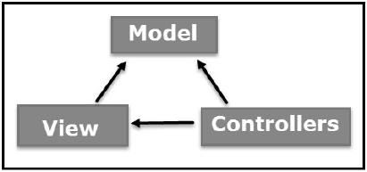

# MVC Architecture :
an architecture pattern that separates an application into three main logical components

Model: component that corresponds to all the data-related logic, that the user works with
- Typically will represent the data that is being transfered between the view and the controller

View: component that is responisible for the User Interface logic of the application
- This will be the part of the application that the end user is interacting with

Controller: component that act as an interface between the model and the view components
- This will process all the business logic and incoming requests
- Manipulate data using the model component, and send the info back to the view to be displayed

# Spring MVC

Spring MVC is a request driven structure centered around a central Servlet using the front controller design pattern

The Spring DispatchServlet is completely integrated with the Spring IOC container

The Dispatch Servlet routes requests to handlers, view resolvers, and also provides support for uploading files

Since DispatchServlet is a servlet itself it must map it in the web.xml

View Resolvers will retrieve the correct view from controller

Spring MVC has several annotations that we can use specifically with MVC components

# Spring MVC Annotations

## @Controller:
will mark the class as a controller, which is a special kind of spring bean that handles requests, the dispatcher will scan for these classes, and send requests to the correct controller

## @RequestMapping:
used to map a uri to a specific class, or to a specific method inside of a controller, you can also include the http metho if it is over a method

## Other important/frequently used annotations
- @RequestBody: is used to gain access to the request body
- @ResponseStatus: used to mark a specific code that a controller method should send in a response
- @RequestParam: used to bind request parameters to specific values in the methods signature
- @PathVariable: used to identify properties directly within the url or the requests, and you can use them in the method
- @RequestHeader: used to get or map our header data in a similar way to @RequestParam
- @ResponseBody: used to automatically marshal java objects to JSON strings
- @RestController: a class level annotation that combines @RequestMapping and @ResponseBody